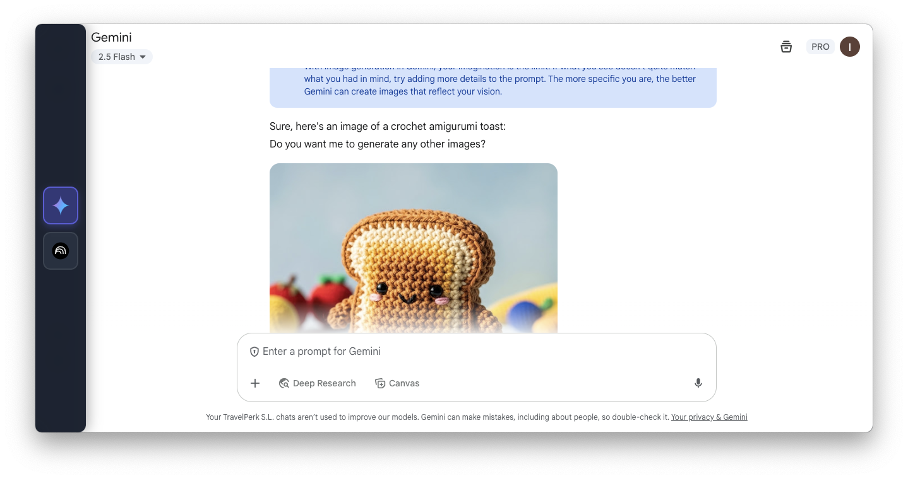

# 🤖 Gemini Quick Chat

A sleek Electron desktop application that provides instant access to AI chat interfaces through a global keyboard shortcut. Switch seamlessly between Google Gemini and NotebookLM with a modern, translucent UI that stays out of your way.



## ✨ Features

- **Global Keyboard Shortcut**: Press `Option+Space` (macOS) or `Alt+Space` (Windows/Linux) to instantly open the chat interface
- **Dual AI Support**: Quick switching between Google Gemini and NotebookLM
- **Modern UI**: Glass-morphism design with slide-out app switcher
- **System Tray Integration**: Convenient tray icon with context menu for app management
- **Auto-hide Behavior**: Window automatically hides when losing focus for distraction-free workflow
- **Always on Top**: Stays above other windows when active for quick access

## 🚀 Installation

### Prerequisites

- Node.js (v16 or higher)
- npm or yarn

### Setup

```bash
# Clone the repository
git clone https://github.com/your-username/gemini-quick-chat.git
cd gemini-quick-chat

# Install dependencies
npm install

# Start the application
npm start
```

### Building for Distribution

```bash
# Build the app for your platform
npm run build
```

## 🎮 Usage

1. **Launch**: Start the app with `npm start` or run the built executable
2. **Access**: Press the global shortcut (`Option+Space` or `Alt+Space`) to open/hide the window
3. **Switch Apps**: Hover over the left sidebar to reveal app switcher buttons
4. **Navigate**: Click Gemini or NotebookLM buttons to switch between AI interfaces
5. **System Tray**: Right-click the tray icon for additional options and quit

## 🏗️ Architecture

The application follows a modular Electron architecture:

- **Main Process** (`src/main/`): Window management, system tray, IPC handling
- **Renderer Process** (`src/renderer/`): UI components and user interactions
- **Preload Scripts** (`src/preload/`): Secure communication bridge
- **Shared Modules** (`src/shared/`): Constants and utilities

## 🛠️ Development

### Available Scripts

```bash
npm start          # Start the application
npm run dev        # Start in development mode
npm run build      # Build for distribution
npm run lint       # Run ESLint
npm run format     # Format code with Prettier
```

### Development Tools

The project includes pre-commit hooks for code quality:

- **ESLint**: Code linting and best practices
- **Prettier**: Automatic code formatting
- **Husky**: Git hooks for quality enforcement

## 📁 Project Structure

```
src/
├── main/                 # Main process modules
│   ├── main.js          # Application entry point
│   ├── window.js        # Window management
│   ├── tray.js          # System tray handling
│   ├── ipc-handlers.js  # IPC communication
│   └── app-state.js     # State management
├── renderer/            # Renderer process
│   ├── index.html       # Main UI
│   ├── styles.css       # Styling and animations
│   └── renderer.js      # UI logic
├── preload/             # Security bridge
│   └── preload.js       # Exposed APIs
└── shared/              # Shared utilities
    └── constants.js     # App constants
```

## 🎨 UI Features

- **Slide-out Sidebar**: Minimal 10px strip expands to reveal app switcher on hover
- **Glass-morphism Effects**: Modern translucent design with backdrop blur
- **Smooth Animations**: 300ms transitions for all interactions
- **Visual Feedback**: Selected states, hover effects, and button scaling
- **Responsive Design**: Adapts to different screen sizes and resolutions

## 🔧 Configuration

Key settings can be modified in `src/shared/constants.js`:

- Window dimensions and behavior
- Keyboard shortcuts
- AI service URLs
- UI timing and animations

## 📚 Documentation

- [Development Guide](docs/DEVELOPMENT.md) - Setup and workflow
- [Architecture Overview](docs/ARCHITECTURE.md) - Technical details
- [Development Health](docs/DEVELOPMENT_HEALTH.md) - Code quality tools

## 🤝 Contributing

1. Fork the repository
2. Create a feature branch (`git checkout -b feature/amazing-feature`)
3. Commit your changes (`git commit -m 'feat: add amazing feature'`)
4. Push to the branch (`git push origin feature/amazing-feature`)
5. Open a Pull Request

## 📄 License

This project is licensed under the MIT License - see the [LICENSE](LICENSE) file for details.

## 🤖 AI Assistant Instructions

**For AI assistants working on this project**: Please read and follow the comprehensive instructions in [`docs/AI_CHANGELOG_INSTRUCTIONS.md`](docs/AI_CHANGELOG_INSTRUCTIONS.md) for:

- 📊 Analyzing git diffs and generating changelogs
- 🏷️ Creating semantic version git tags
- 📝 Following the complete release workflow

The instructions contain detailed guidelines for semantic versioning, changelog formatting, and git tagging best practices.
